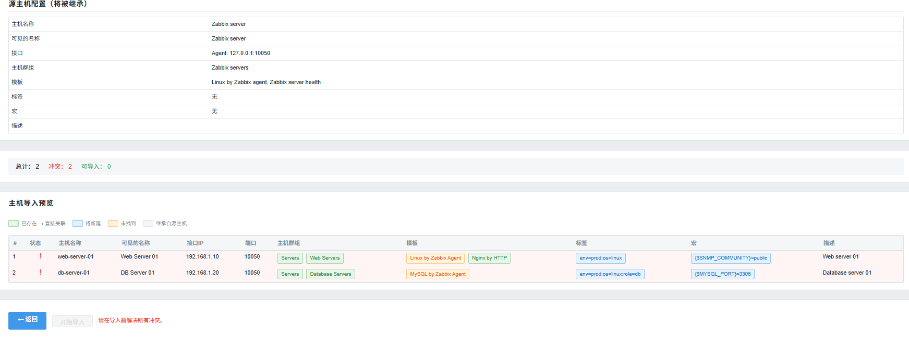

# Host Batch Clone 模块

[English](https://github.com/jxl1216/zabbix_modules/blob/master/README_en.md)

## ✨ 版本兼容性

本模块兼容 Zabbix 6.0 / 7.0+ / 8.0+ 版本。

- ✅ Zabbix 6.0.x
- ✅ Zabbix 6.4.x
- ✅ Zabbix 7.0.x
- ✅ Zabbix 7.4.x
- ✅ Zabbix 8.0.x

**兼容性说明**：模块内置智能版本检测机制（`CompatHelper`），自动适配不同版本的 Zabbix API 参数差异（如 `selectGroups` vs `selectHostGroups`），无需手动配置。

## 描述

这是一个 Zabbix 前端模块，用于基于已有监控主机的配置批量克隆导入大量主机。模块在 Zabbix Web 的数据采集菜单下新增"主机批量导入"菜单项，支持 CSV 文件导入和在线表格录入两种方式，并提供预览、冲突检测和实时导入进度反馈功能。


  

## 功能特性

- **源主机克隆**：选择任意已有监控主机作为克隆模板，其全部配置（接口、群组、模板、标签、宏等）均可被继承

- **双模式数据录入**：
  - CSV 文件上传：支持 UTF-8 和 GBK 编码，自动表头检测和编码识别
  - 在线表格录入：支持添加/删除行，数据实时校验

- **智能字段继承**：仅主机名称和接口 IP 为必填项，其他字段（端口、群组、模板、标签、宏、描述）留空时自动继承源主机配置

- **主机群组自动创建**：导入时 CSV 中指定的主机群组若不存在，自动调用 API 创建后再关联

- **预览与冲突检测**：导入前全面预览，自动检测主机名冲突、必填字段缺失等问题

- **导入进度反馈**：逐台 AJAX 创建主机，实时进度条和成功/失败计数

- **结果报告导出**：导入完成后可下载 CSV 格式的结果报告

- **中英文双语支持**：界面支持中/英文切换

- **响应式设计**：适配不同屏幕尺寸

- **现代化界面**：遵循 Zabbix 原生设计风格

## 安装步骤

### 方法一：通过 Releases 下载安装（推荐）

1. 访问 [Releases](https://github.com/jxl1216/zabbix_modules/releases) 页面
2. 下载最新版本的 `HostBatchClone_vX.X.zip` 文件
3. 解压并部署：

```bash
# Zabbix 6.0 / 7.0
unzip HostBatchClone_vX.X.zip -d /usr/share/zabbix/modules/

# Zabbix 7.4 / 8.0
unzip HostBatchClone_vX.X.zip -d /usr/share/zabbix/ui/modules/
```

### 方法二：通过 Git 克隆安装

```bash
# Zabbix 6.0 / 7.0
git clone https://github.com/jxl1216/zabbix_modules.git /usr/share/zabbix/modules/zabbix_modules

# Zabbix 7.4 / 8.0
git clone https://github.com/jxl1216/zabbix_modules.git /usr/share/zabbix/ui/modules/zabbix_modules
```

### ⚠️ Zabbix 6.0 兼容性处理

**仅 Zabbix 6.0 用户需要执行此步骤！**

```bash
# Zabbix 6.0 / 7.0
sed -i 's/"manifest_version": 2.0/"manifest_version": 1.0/' /usr/share/zabbix/modules/zabbix_modules/HostBatchClone/manifest.json

# Zabbix 7.4 / 8.0
sed -i 's/"manifest_version": 2.0/"manifest_version": 1.0/' /usr/share/zabbix/ui/modules/zabbix_modules/HostBatchClone/manifest.json
```

Zabbix 7.0+ / 8.0+ 用户无需修改，保持默认值即可。

### 启用模块

```bash
# 设置文件所有权（根据你的 Web 服务器用户选择）
# Zabbix 6.0 / 7.0
chown -R nginx:nginx /usr/share/zabbix/modules/zabbix_modules/HostBatchClone/
# 或 chown -R www-data:www-data /usr/share/zabbix/modules/zabbix_modules/HostBatchClone/

# Zabbix 7.4 / 8.0
chown -R nginx:nginx /usr/share/zabbix/ui/modules/zabbix_modules/HostBatchClone/
# 或 chown -R www-data:www-data /usr/share/zabbix/ui/modules/zabbix_modules/HostBatchClone/

# 重载 PHP-FPM
systemctl reload php-fpm
```

1. 进入 Zabbix Web 界面，导航到 **Administration → General → Modules**。
2. 点击 **Scan directory** 扫描新模块，找到"主机批量导入"模块并启用。
3. 刷新页面，模块将在 **Data collection（数据采集）** 菜单下显示为"主机批量导入"，位于"Hosts（主机）"之后。

## 注意事项

- **性能考虑**：导入采用逐台串行方式，大批量导入可能需要较长时间。建议单次导入不超过 500 台主机。

- **主机名唯一性**：主机名在 Zabbix 中与模板名共享命名空间，必须全局唯一。预览阶段会同时检测主机和模板冲突。

- **模板依赖**：CSV 中指定的模板必须在 Zabbix 中已存在，否则导入时仅关联已存在的模板。

- **CSV 编码**：建议使用 UTF-8 BOM 编码保存 CSV 文件以确保在 Excel 和程序中都能正确显示中文。

- **数据准确性**：创建的监控主机基于源主机的当前配置快照。如果源主机在导入过程中被修改，已创建的主机不会受影响。

## 开发

模块基于 Zabbix 模块框架开发。文件结构：

- `manifest.json`：模块配置、路由和静态资源声明
- `Module.php`：菜单注册
- `CompatHelper.php`：Zabbix 6.0/6.4/7.x API 兼容性辅助类
- `actions/`：控制器（主页面、预览、导入、源主机加载）
- `views/`：页面视图（主页面、预览、JSON 响应）
- `assets/js/`：JavaScript（CSV 解析、表格管理、AJAX 导入进度）
- `assets/css/`：模块样式表

如需扩展，可参考 [Zabbix 模块开发文档](https://www.zabbix.com/documentation/current/zh/devel/modules/file_structure)。

## 许可证

本项目遵循 GPL-2.0 许可证。