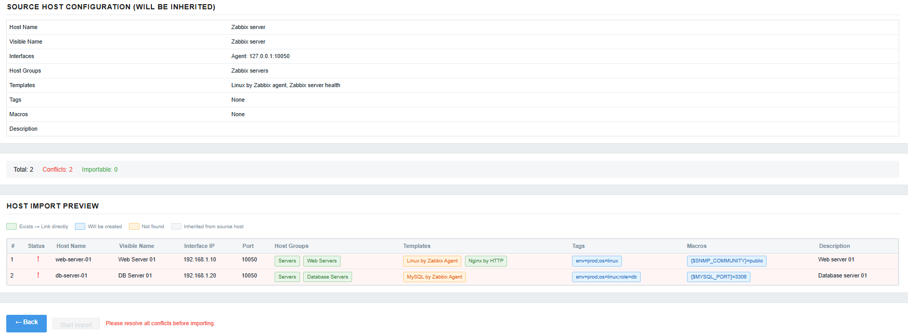
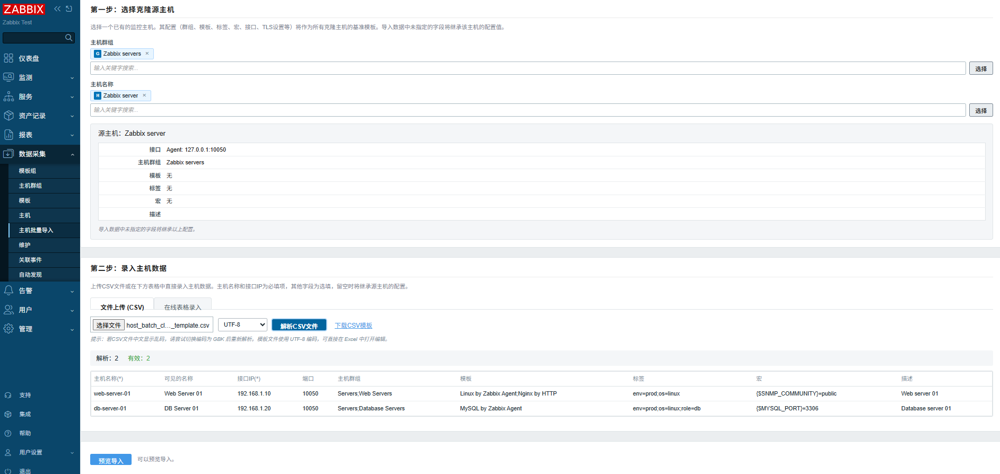
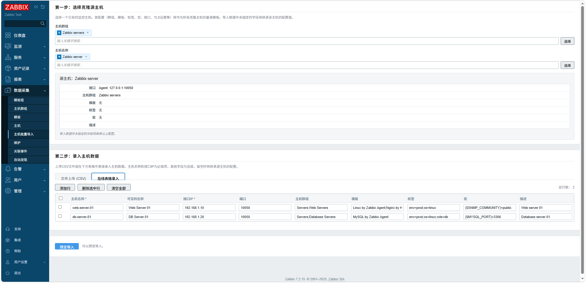

# Host Batch Clone Module

[中文](README.md)

## ✨ Version Compatibility

This module is compatible with Zabbix 6.0 / 6.4 / 7.0+ / 7.2+ / 8.0+.

- ✅ Zabbix 6.0.x
- ✅ Zabbix 6.4.x
- ✅ Zabbix 7.0.x
- ✅ Zabbix 7.2.x
- ✅ Zabbix 7.4.x
- ✅ Zabbix 8.0.x

**Compatibility Note**: The module has a built-in intelligent version detection mechanism (`CompatHelper`) that automatically adapts to Zabbix API parameter differences across versions (e.g., `selectGroups` in 6.0 vs `selectHostGroups` in 6.4+, `groups` vs `hostgroups` result key differences, `Zabbix\Core\CModule` vs `Core\CModule` namespace differences, etc.) — no manual configuration required. The `LangHelper` automatically switches between Chinese and English interfaces following the Zabbix system language setting.

## Description

This is a Zabbix frontend module for batch cloning and importing a large number of hosts based on the configuration of an existing monitored host. The module adds a "Host Batch Import" menu item under the "Data collection" menu in the Zabbix Web UI (after "Hosts"), supporting both CSV file import and online table entry, with preview, conflict detection, and real-time import progress feedback.






## Features

- **Source Host Cloning**: Select any existing monitored host as a cloning template; all of its configuration (interfaces, groups, templates, tags, macros, TLS, IPMI, inventory mode, etc.) can be inherited.

- **Dual-mode Data Entry**:
  - CSV file upload: supports UTF-8 and GBK encoding, automatic header detection and encoding recognition, CSV template download available
  - Online table entry: supports adding/deleting rows, clear all, real-time data validation

- **Smart Field Inheritance**: Only host name and interface IP are required; other fields (visible name, port, host groups, templates, tags, macros, description) automatically inherit from the source host when left blank.

- **Auto-creation of Host Groups**: During import, host groups specified in CSV that do not exist will be automatically created via API and then associated.

- **Preview and Conflict Detection**: Full preview before import, automatically detecting host name conflicts, missing required fields, duplicates within the batch, name conflicts with existing hosts/templates, etc.; status indicators distinguish "exists → link directly", "will be created", "not found", "inherited from source host".

- **Import Progress Feedback**: Hosts are created one by one via AJAX, with a real-time progress bar and success/failure counts.

- **Result Report Export**: After import, you can download a CSV-format result report (including host name, IP, host ID, result, error information).

- **Bilingual Support (Chinese/English)**: Interface language automatically follows the Zabbix system setting (`zh_CN` / `en_GB`), no gettext dependency.

- **Responsive Design**: Adapts to different screen sizes.

- **Modern UI**: Follows Zabbix native design style.

## Installation

### Method 1: Download Release tarball (Recommended for production deployment)

Download the packaged `tar.gz` archive from GitHub Releases, upload it to the server and extract manually — no git required.

1. **Download the archive**

   Go to the [Releases page](https://github.com/jxl1216/zabbix_modules/releases) and download the latest `HostBatchClone-x.x.x.tar.gz` file. For example, download `HostBatchClone-1.1.tar.gz`.
2. Upload to the Zabbix server and extract to the modules directory:

   ```bash
   # Zabbix 6.0 / 7.0
   tar -xzf HostBatchClone-1.1.tar.gz -C /usr/share/zabbix/modules/

   # Zabbix 7.2 / 7.4 / 8.0
   tar -xzf HostBatchClone-1.1.tar.gz -C /usr/share/zabbix/ui/modules/
   ```

   After extraction, a `HostBatchClone/` subdirectory will be created under the modules directory, with the following structure:

   ```text
   /usr/share/zabbix/ui/modules/
   └── HostBatchClone/
       ├── manifest.json
       ├── Module.php
       ├── CompatHelper.php
       ├── LangHelper.php
       ├── actions/
       ├── assets/
       ├── views/
       ├── images/
       └── host_batch_clone_template.csv
   ```

4. **⚠️ If using Zabbix 6.0, modify manifest_version**

   ```bash
   sed -i 's/"manifest_version": 2.0/"manifest_version": 1.0/' /usr/share/zabbix/modules/HostBatchClone/manifest.json
   ```

   No modification is needed for Zabbix 6.4+ / 7.0+ / 7.2+ / 8.0+ — keep the default value.

5. **Set file ownership and reload PHP-FPM**

   ```bash
   # Set file ownership (choose based on your web server user)
   chown -R nginx:nginx /usr/share/zabbix/ui/modules/HostBatchClone/
   # or chown -R www-data:www-data /usr/share/zabbix/ui/modules/HostBatchClone/

   # Reload PHP-FPM
   systemctl reload php-fpm
   ```

6. **Clean up temporary files**

   ```bash
   rm -f /tmp/HostBatchClone-x.x.x.tar.gz
   ```

### Method 2: git clone direct deployment (for development / tracking updates)

```bash
# Zabbix 6.0 / 7.0
git clone https://github.com/jxl1216/zabbix_modules.git /usr/share/zabbix/modules/

# Zabbix 7.2 / 7.4 / 8.0
git clone https://github.com/jxl1216/zabbix_modules.git /usr/share/zabbix/ui/modules/
```

If using Zabbix 6.0, you also need to modify manifest_version:

```bash
sed -i 's/"manifest_version": 2.0/"manifest_version": 1.0/' HostBatchClone/manifest.json
```

### Enable the Module

1. Go to the Zabbix Web UI, navigate to **Administration → General → Modules**.
2. Click the **Scan directory** button to scan for new modules.
3. Find the "Host Batch Import" module and enable it.
4. Refresh the page; the module will appear under the **Data collection** menu as "Host Batch Import", after "Hosts".

## CSV Data Format

The module includes a template file `HostBatchClone/host_batch_clone_template.csv`, which can be downloaded by clicking "Download CSV Template" on the import page. CSV headers and field descriptions:

| Field | Required | Description |
| --- | --- | --- |
| Host Name(*) | Yes | Host identifier, must be globally unique (shares namespace with templates) |
| Visible Name | No | Uses host name when left blank |
| Interface IP(*) | Yes | Host interface IP address |
| Port | No | Inherits source host port when left blank |
| Host Groups | No | Multiple groups separated by `;`, auto-created if not found |
| Templates | No | Multiple templates separated by `;`, matched by host or name |
| Tags | No | Format `tag=value`, multiple separated by `;` |
| Macros | No | Format `{$MACRO}=value`, multiple separated by `;` |
| Description | No | Host description |

Example:

```csv
Host Name(*),Visible Name,Interface IP(*),Port,Host Groups,Templates,Tags,Macros,Description
web-server-01,Web Server 01,192.168.1.10,10050,Servers;Web Servers,Linux by Zabbix Agent;Nginx by HTTP,env=prod;os=linux,{$SNMP_COMMUNITY}=public,Web server 01
db-server-01,DB Server 01,192.168.1.20,10050,Servers;Database Servers,MySQL by Zabbix Agent,env=prod;os=linux;role=db,{$MYSQL_PORT}=3306,Database server 01
```

## Notes

- **Performance Considerations**: Import is done serially (one host at a time); large batch imports may take a long time. It is recommended to import no more than 500 hosts at a time.

- **Host Name Uniqueness**: Host names share the namespace with template names in Zabbix and must be globally unique. The preview phase detects both host and template conflicts.

- **Template Dependency**: Templates specified in CSV must already exist in Zabbix; otherwise, only existing templates will be associated during import (templates not found will be marked as "not found").

- **CSV Encoding**: It is recommended to save CSV files in UTF-8 encoding. If Chinese characters display as garbled, try switching the encoding to GBK and re-parsing on the page.

- **Permission Requirement**: Using this module requires Zabbix Admin or higher permissions.

- **Data Accuracy**: Created hosts are based on a snapshot of the source host's current configuration. If the source host is modified during the import process, already created hosts will not be affected.

## Development

This module is developed based on the Zabbix module framework. File structure:

- `HostBatchClone/manifest.json`: module configuration, routes and static asset declarations
- `HostBatchClone/Module.php`: menu registration (compatible with `Zabbix\Core\CModule` and `Core\CModule`)
- `HostBatchClone/CompatHelper.php`: Zabbix 6.0/6.4/7.x/8.x API compatibility helper class
- `HostBatchClone/LangHelper.php`: bilingual (Chinese/English) internationalization management (pure PHP array implementation, no gettext dependency)
- `HostBatchClone/actions/HostCloneView.php`: main page controller (source host selection, CSV upload, table entry)
- `HostBatchClone/actions/HostCloneSource.php`: AJAX source host configuration loading endpoint
- `HostBatchClone/actions/HostClonePreview.php`: preview page controller (conflict detection, field status)
- `HostBatchClone/actions/HostCloneImport.php`: AJAX import endpoint (creates hosts one by one)
- `HostBatchClone/views/`: page views (main page, preview, JSON response)
- `HostBatchClone/assets/js/`: JavaScript (CSV parsing, table management, AJAX import progress)
- `HostBatchClone/assets/css/`: module stylesheet
- `HostBatchClone/host_batch_clone_template.csv`: CSV import template

For extensions, refer to the [Zabbix Module Development Documentation](https://www.zabbix.com/documentation/current/en/devel/modules/file_structure).

## Version Release

This module is automatically packaged and released via GitHub Actions. When the `version` field in `HostBatchClone/manifest.json` is upgraded and pushed to the main branch, the packaging process is automatically triggered, generating a `HostBatchClone-<version>.tar.gz` archive and publishing it to the [Releases page](https://github.com/jxl1216/zabbix_modules/releases).

Each Release includes:

- `HostBatchClone-<version>.tar.gz`: complete module code archive. After extraction, you get a `HostBatchClone/` directory that can be deployed directly to the Zabbix modules directory.

## License

This project is licensed under the GPL-2.0 License.
